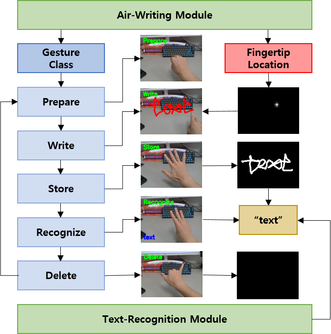

## Air-Text: Air-Writing and Recognition System (ACMMM 2021, Oral)
This is the official PyTorch implementation for our work; **Air-Text: Air-Writing and Recognition System**. Here, you can find source codes for model training and brief demo as shown below.
<p align="center"></p>

---
### Overview
Air-Text is a novel system to write in the air using fingertips as a pen. Air-Text provides various functionalities by the seamless integration of Air-Writing and Text-Recognition Modules. 
<p align="center"></p>

---
### Environment Setup
All the experiments were performed on Ubuntu 16.04 and using [Anaconda](https://www.anaconda.com/distribution/) is recommended.
```shell
conda create -n airtext_env python=3.6
conda activate airtext_env
conda install pytorch==1.5.0 torchivision==0.6.0 cudatoolkit=10.2 -c pytorch
pip install opencv-python torchsummary tensorboardX matplotlib lmdb natsort nltk
```

---
### Training Air-Writing Module
In order to train Air-Writing Module, first download [SCUT-Ego-Gesture dataset](http://www.hcii-lab.net/data/). (Currently, as there is no direct link to download the dataset, you should consider contacting the authors of [this paper](https://openaccess.thecvf.com/content_ICCV_2017_workshops/papers/w11/Wu_YOLSE_Egocentric_Fingertip_ICCV_2017_paper.pdf).)

Download and extract the dataset in `./AirWritingModule/dataset`, type command `cd ./AirWritingModule` and run `train.py`.

---
### Training Text-Recognition Module

#### Single Digit Recognition
In order to train Text-Recognition Module for single digit recognition, just type command `cd ./TextRecognitionModule/MNIST` and run `digitmodel.py`. Downloading [MNIST dataset](http://yann.lecun.com/exdb/mnist/) and training will be started automatically.

#### English Word Recognition
In order to train Text-Recognition Module for English word recognition, first download IAHEW-UCAS2016 dataset. (You should contact the authors of [this paper](https://link.springer.com/content/pdf/10.1007/s00521-017-3260-9.pdf).) Download and extract the dataset in `./TextRecognitionModule/Word/data` and run following commands.
```shell
cd ./TextRecognitionModule/Word
python plot_real.py              \\ To convert sequence data into images and it takes a large amount of time
python create_dataset_real.py    \\ To convert image files into lmdb format
git clone https://github.com/clovaai/deep-text-recognition-benchmark
```

---
### Pre-trained weights
Pre-trained weights for above all three models can be downloaded from [here](https://drive.google.com/file/d/1BehjQ5S65Z7kA-_0vJkYcRwy0Z52ACpT/view?usp=sharing). Extract all the files in the root directory of this repository.

---
### Demo
First, check you can get a video input by connecting a webcam to your desktop.
If you want to test single digit recognition, please run `demo_digit.py` in the terminal. Or you can test English word recognition by running `demo_word.py`.

---
### Acknowledgments

- This work was partly supported by Institute for Information & communications Technology Promotion(IITP) grant funded by the Korea government(MSIT) (No.2020-0-00440, Development of artificial intelligence technology that continuously improves itself as the situation changes in the real world) and (No.2020-0-00842, Development of Cloud Robot Intelligence for Continual Adaptation to User Reactions in Real Service Environments).

- Parts of the codes and datasets are adopted from previous works ([Deep-Text-Recognition-Benchmark](https://github.com/clovaai/deep-text-recognition-benchmark),  [YOLSE](https://openaccess.thecvf.com/content_ICCV_2017_workshops/papers/w11/Wu_YOLSE_Egocentric_Fingertip_ICCV_2017_paper.pdf), and [Attention Recurrent Translator](https://link.springer.com/content/pdf/10.1007/s00521-017-3260-9.pdf)). We appreciate the original authors for their awesome works. 

### Citation
```bash
@article {lee2021airtext,
    author = {Sun-Kyung Lee, and Jong-Hwan Kim},
    title = {Air-Text: Air-Writing and Recognition System},
    year = {2021},
    doi = {???},
    URL = {https://doi.org/???},
}
```
